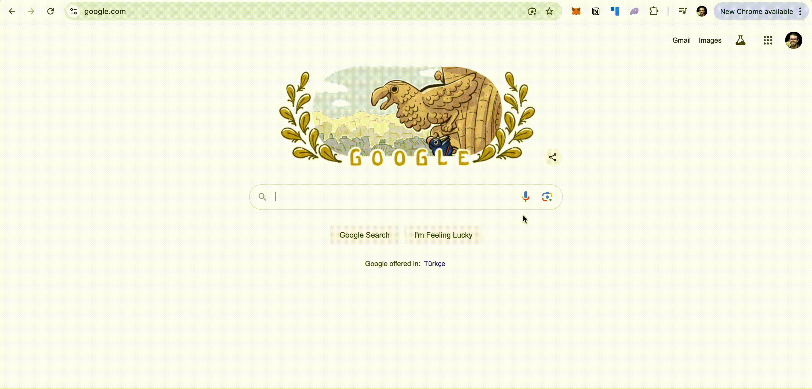

# gcloud-speech-to-text
This project contains helpful resource to start with using google cloud speech to text API in streaming mode at scale.

## Backend 

This folder contains backend developeed using two different programming language:

1. [Node](./docs/node.md): using express JS framework
2. [Python](./docs/python.md): using fastAPI framework

## Scale 

These are python scripts to test the scale of the backend and measure the latencies.

- Click [Here](./docs/scale.md) to learn more about.

## Frontend

Frontend application using nextJS to consume the API

**WIP**

## Resources 

**Python**

- https://ismatsamadov.medium.com/an-introduction-to-socket-programming-in-python-ea5480ff658e

- https://ismatsamadov.medium.com/asgi-vs-wsgi-87ba76d24365

- https://ismatsamadov.medium.com/gunicorn-vs-uvicorn-369635b92809